# 【小工具】饶老师力荐！一键分享史诗瞬间！
## 出发点：
受到 [网页版史诗收集器] 的启发, 本来想做一个 PC 端的版本。

但不巧 DNF 在 4 月 23 号就更新了这一功能(虽然只针对单角色), 

再加上100级已经上线一个多月了, 就暂时打消了这个想法。

做这个程序呢， 是因为 DNF 虽然有史诗自动截图， 

却还是有让饶老师非常生气的门锁/座机/手机拍史诗的行为， 

比如这样的：
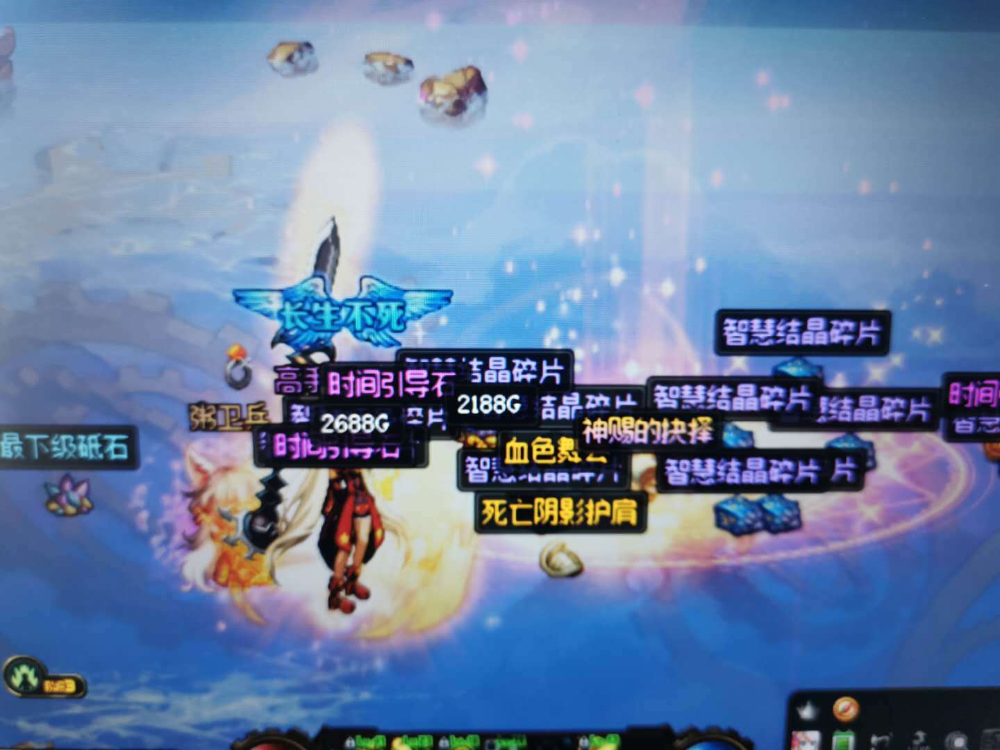

这样的:

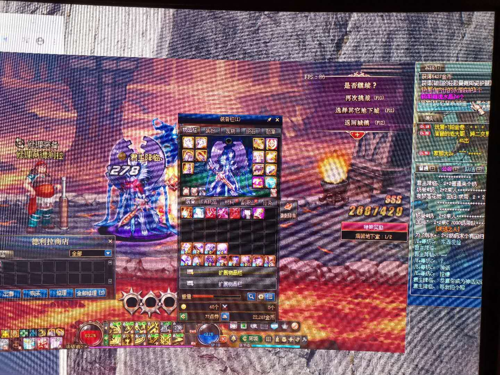

还有这样的:

让我这样看, 你很爽吗?

这对广大DNF玩家的颈椎也非常不友好。

于是呢， 饶老师就找到了我， 让我做这样一个程序。

---

## 程序功能

在说程序功能之前呢， 先来看一下不同截图水平的玩家， 是怎么分享截图的：

### 门锁党玩家:    

第一步: 深渊出货后抄起门锁咔嚓就是一张
第二步: 分享

总结：经常被饶老师，诸葛亮强制上课。

### 一般玩家:
   
第一步: 深渊出货后, 使用下列快捷键对史诗截图
- Windows+Shit+S(系统快捷键) 
- Windows+Alt+PrintScreen(系统快捷键) 
- Alt+A(微信快捷键) 
- Ctrl+Alt+A(QQ快捷键)
- PrintScreen(游戏和系统快捷键) 等等

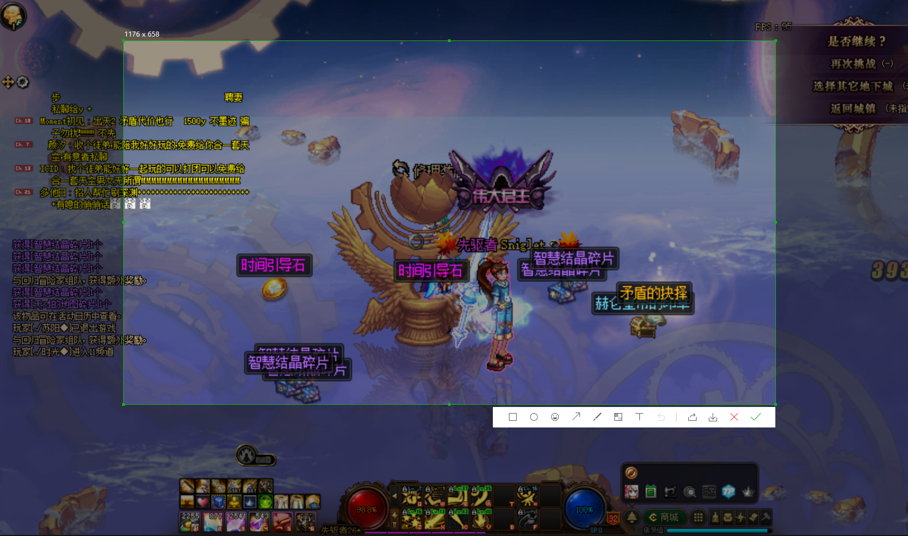

第二步: 分享
    
总结：这种方式，截的是地上的史诗，不够激情。

### 中级玩家:

第一步: 打开文件管理器

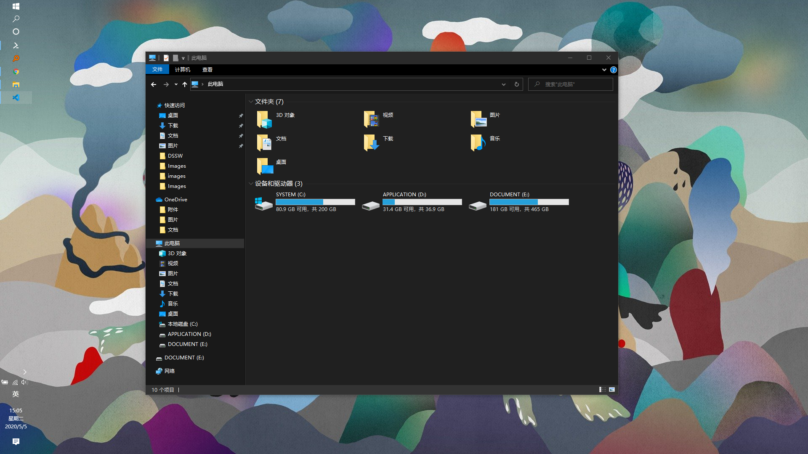

第二步: 找到对应文件夹, 并找到想要的图片复制

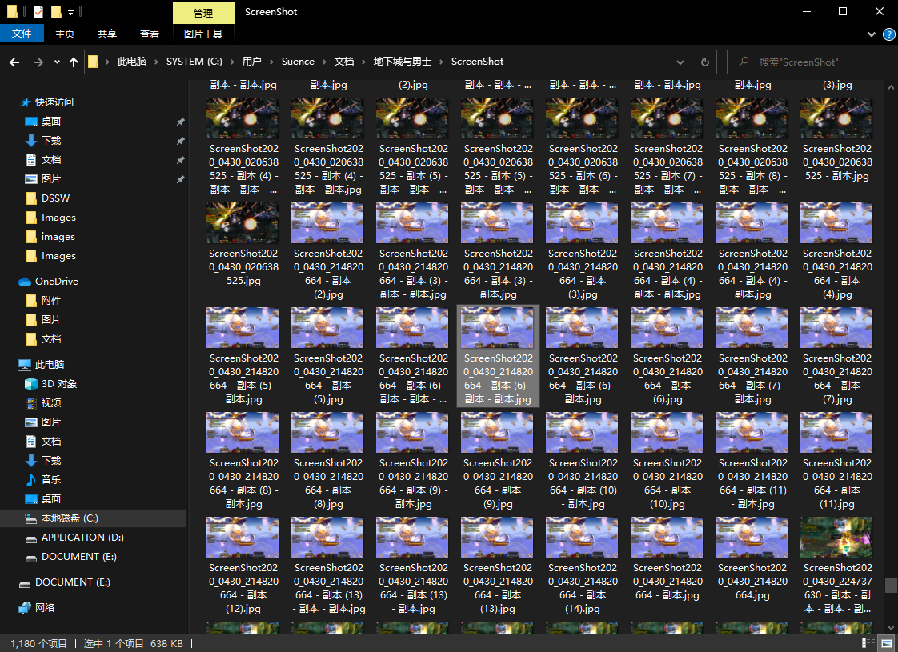

第三步: 分享

总结：这种方式，较为繁琐。

高级玩家:

第一步: 深渊出货的瞬间以迅雷不及掩耳之势按下上面快捷键的一种, 对史诗截图(迅雷别忘了给我打广告费)

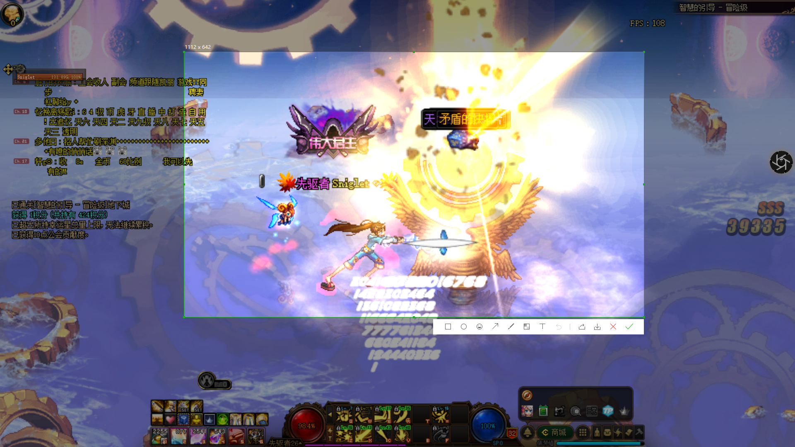

第二步：分享

总结：对反应和手速有一定要求。

读到这儿， 想必你已经知道这个程序是干什么的了。

没错， 程序的功能就是让中级玩家的前两步操作合并为一个按钮，达到和高级截图玩家一样的效果。

---
## 程序 UI
因为在使用过程中， 程序一般是常驻与游戏上方的， 
所以程序的 UI 风格， 都尽可能的和 DNF 保持一致。
图标实在是没找到合适的，

好了， 废话不多说。来看一下演示和截图吧！

## 演示
如图：当你深渊出货的时候, 这个程序提供一个截图分享的功能, 点击[复制到剪贴板]按钮后, 在需要的地方(QQ/微信等) Ctrl+v(右键粘贴) 即可。

gif 图演示:

B站视频演示:
[https://www.bilibili.com/video/BV1h541147Lt](https://www.bilibili.com/video/BV1h541147Lt)

7秒无操作后， 分享窗口会自动关闭，或者手动关闭。

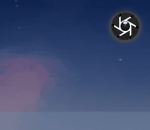

## 程序部分截图
下面是一些 UI 的对比图

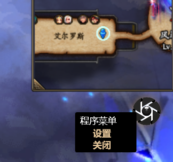

设置功能看具体需求，在以后的版本中加入。

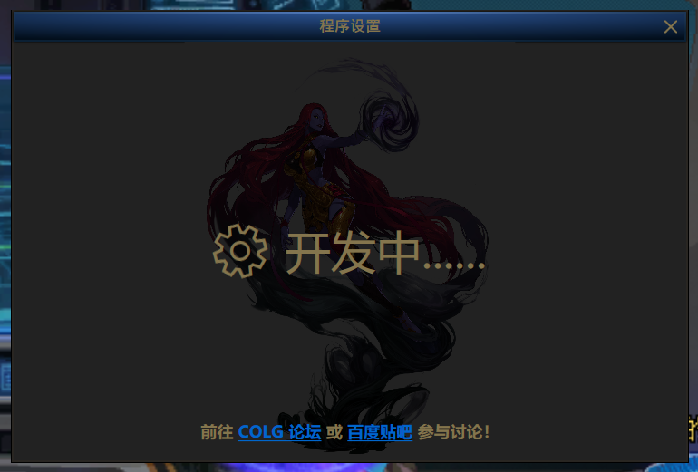
---

## 关于病毒

1：程序没有联网功能

2：全部源代码已经公开到 Github， 有无病毒， 懂点编程的朋友，一看便知。

源代码位置：https://github.com/Suence/DSSW

现在已经为源代码添加了注释, 方便阅读~
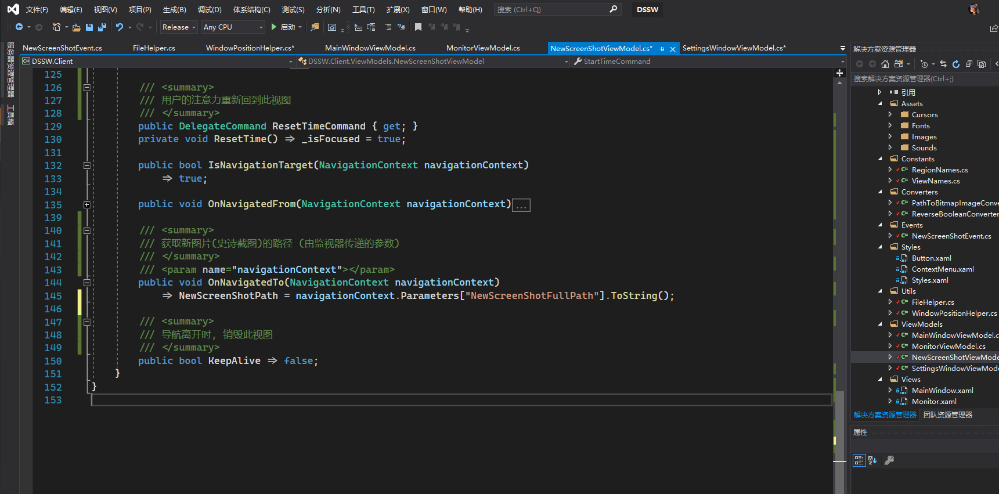

---
## 下载与安装
1：以免一些朋友从不明网站(或QQ群等方式)下载的程序可能存在木马病毒。
因此我在阿里云买了一台服务器及域名，用于托管此程序。
现在可前往此程序对应的网站直接下载程序。

唯一网站: [suence.net](http://www.suence.net)

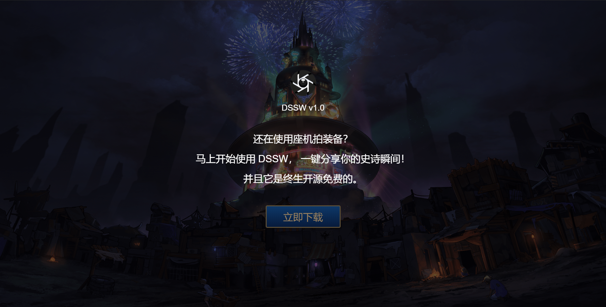

2: 从 Github 克隆本程序的全部源代码, 使用 VS (Visual Studio 2017及以上版本) 手动编译。

## 硬盘与内存开销
内存:

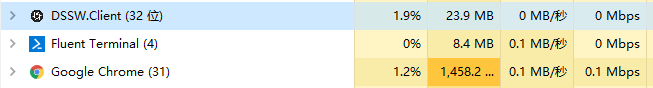

硬盘:

## 关于版本更新

通过第一种下载方式获取的程序， 可自动检测更新， 无需重新下载和安装。

通过第二种方式获取的程序， 可以及时拉取最新源代码， 进行手动编译以及运行。

## 注意事项
在安装或更新时， Windows 会有 “未知发布者” 提示弹窗。
这是程序签名和证书的原因。

点击 [详细信息]-> [仍要运行] 以继续安装。 

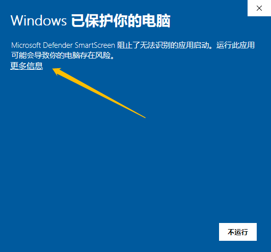
